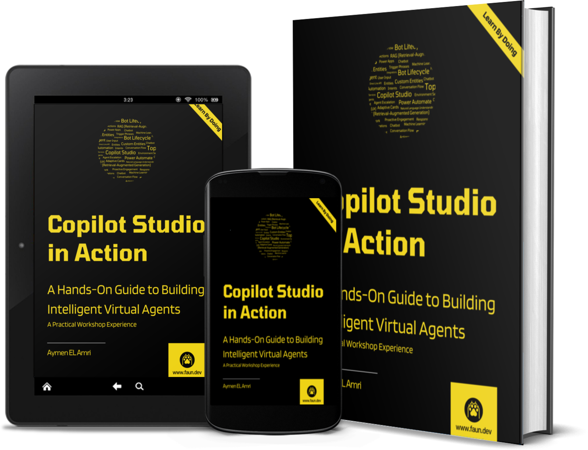

# Copilot Studio in Action: A Hands-On Guide to Building Intelligent Virtual Agents

This repository contains the resources and files for the book "**Copilot Studio in Action: A Hands-On Guide to Building Intelligent Virtual Agents**" by Aymen El Amri.

## The Book

Once upon a time, in the early days of artificial intelligence, pioneers embarked on a historic quest to build machines that could think and reason like humans. This journey began not in data centers or with thousands of GPUs, but with symbols—like those used by ancient mathematicians and philosophers. It was the 1950s, a time when computers were the size of rooms and far from the lightweight yet powerful devices we know today. Yet, the dreams of creating intelligent machines were already alive. Before creating artificial intelligence, scientists first had to understand and define intelligence itself.

A group of researchers believed that intelligence could be represented through symbols and rules—a perspective that led to the rise of symbolic AI.

Another group of researchers believed that creating an intelligent system should be inspired by the human brain itself—a neural network approach. This led to the rise of connectionism, which later evolved into the deep learning models and generative AI technologies we see today.

Two schools of thought emerged in the early days of AI—Symbolism and Connectionism. One had its roots in logic and reasoning, while the other was more biological and Darwinian in nature.

Symbolic AI, also known as Good Old-Fashioned AI (GOFAI), remains relevant even today, despite being overshadowed by the rise of neural networks and deep learning. Many AI systems, like expert systems, robotic process automation (RPA), chatbots, and even smart assistants like Alexa and Siri, still use symbolic AI. Unlike generative AI, symbolic AI is more power-efficient as it can function efficiently on standard CPUs and is often less error-prone, especially when dealing with structured data.

Connectionism, on the other hand, powers the deep learning and generative models prevalent today. However, it's not without its challenges. These models require vast amounts of data and computational resources and are often considered "black boxes" due to their complex and opaque inner workings.

Each approach has its strengths and weaknesses, but what if there was a way to leverage the best of both? Enter neuro-symbolic AI. By combining the strengths of both worlds, neuro-symbolic AI aims to create more robust and adaptable systems that can reason contextually and learn from data efficiently.

In my opinion, Copilot Studio has, in some ways, achieved this by combining the power of generative AI with the structured, rule-based logic of symbolic AI. Probably calling Copilot Studio a neuro-symbolic AI platform is an overstatement, but it does bring the best of both worlds in a unique way. Through its platform, users can create AI systems that not only generate content or answers dynamically but also follow specific rules and logic defined by the developer in "Topics" that are triggered based on rules and conditions. This hybrid approach allows copilots to use the right context, tools, and actions based on the situation. As a result, it enables more precise and coherent responses, especially in complex scenarios where both contextual understanding and logical reasoning are required.

This is, in fact, what motivated me to write "**Copilot Studio in Action: A Hands-On Guide to Building Intelligent Virtual Agents**" - a comprehensive guide that I wished existed when I began my journey with AI-driven virtual assistants. I wanted to create a resource that would help beginners and intermediate users understand and master this powerful tool and empower them to become proficient in building exceptional smart assistants without the need for a Ph.D. in AI or computer science.

I'm sure you're eager to dive into your Copilot Studio journey, so let's get started!

## What You Will Learn

In this guide, you’ll learn how to build intelligent, interactive copilots and agents from the ground up using Microsoft Copilot Studio’s powerful capabilities. I’ll guide you through creating and configuring Copilot, structuring conversations, and using Generative AI for context-aware, interactive responses. You’ll master setting up topics and variables, using entities, and applying advanced features like conditional logic, adaptive cards, and Power Fx formulas to build engaging virtual assistants and action bots.

With practical examples, you’ll connect your copilot to external services, automate workflows with Power Automate, and leverage the power of Retrieval Augmented Generation (RAG) for real-time, context-conscious responses. You’ll also learn to manage multilingual support, so you can reach a global audience.

This guide doesn’t just stop at building virtual assistants and assistants; it takes you further into optimizing performance through advanced analytics, tracking user interactions, and integrating tools external tools for real-time monitoring.

These are some of the key topics we’ll cover:

- Create and configure Copilot using various templates, setting up essential details like name, icon, and description.
- Structure conversations using topics and customize them to fit specific needs, including creating, editing, and deleting topics.
- Utilize Generative AI for context-aware, interactive conversations and understand its advantages over traditional chatbots.
- Test, modify, and interact with Copilot in real-time while managing variables like user roles and data inputs effectively.
- Implement conditional logic, adaptive cards, and Power Fx formulas to personalize responses and manage dynamic user interactions.
- Use entities, both prebuilt and custom, to extract and validate user inputs accurately and ensure correct data handling.
- Set up loops, conditional nodes, and manage ambiguous inputs to enhance conversation flows and handle user variations.
- Connect external services using connectors like Gmail, Salesforce, and SharePoint, and automate tasks such as sending emails or updating records using Power Automate.
- Create complex workflows using Power Automate, integrating them with Copilot for seamless automated processes and data management.
- Leverage Retrieval Augmented Generation (RAG) for enhanced information retrieval and context-aware responses based on indexed sources like PDFs and databases.
- Add multilingual support to extend Copilot’s reach, using localization files for translating elements and managing secondary languages.
- Track key analytics like engagement, resolution, escalation, and abandonment rates; analyze user satisfaction with CSAT scores.
- Integrate Application Insights for advanced performance tracking and add custom telemetry events to monitor specific interactions and optimize functionality.
- Configure authentication settings for public or restricted access based on your copilot's audience, and integrate Copilot into multiple platforms like Teams, web, or mobile apps.

You guessed it right! "Chatbot" is an understatement for what you’ll build. Mastering Copilot Studio will empower you to create action bots, virtual assistants, and intelligent agents that can handle complex tasks. This guide will arm you with the necessary skills to achieve this and more.

## To Whom This Guide Is For

Anyone who wants to build intelligent, interactive agents and virtual assistants capable of handling multiple tasks, understanding context, and providing personalized responses will benefit from this guide. Whether you’re building virtual assistants for customer service, internal support, automation, productivity, general question-answering, or other use cases, this guide will help you master Microsoft Copilot Studio and achieve your goals.

You don't need to be an AI expert, developer, or software engineer to get started. This guide is designed for beginners and intermediate users, explaining complex concepts in simple terms. The step-by-step instructions, practical examples, and real-world scenarios will help you understand the concepts and apply them to your projects.

## How to Use This Guide

This guide is structured as a step-by-step, workshop-style tutorial that will take you through all the necessary steps to build powerful virtual assistants using Copilot Studio. Throughout the sections and chapters, we will build a real-world virtual assistant for Solara employees — a fictional company needing assistance with its employee training and development program. While building the virtual assistant, you will discover the features, capabilities, tools, connectors, integrations, and best practices of Copilot Studio. I highly recommend following along step by step without skipping any sections, as each section builds on the previous one.

## Keeping Up to Date

If you are interested in staying updated with the rapid advancements in the AI/ML ecosystems, I warmly invite you to join our vibrant developer community at [www.faun.dev/join](https://www.faun.dev/join). As a member of our community, you will receive weekly newsletters designed to keep you informed and ahead of the curve. These newsletters are hand-curated, filled with must-read tutorials, the latest news, and profound insights from leading experts in the software engineering community. By leveraging this resource, you will ensure that you are always up-to-date with the latest trends, giving you an advantage in your technological journey.

## About the Author

Aymen El Amri is an author, entrepreneur, trainer, and multi-disciplinary software engineer. He has worked in various roles, responsibilities, and projects in the technology field, including software development, chatbots, AI, cloud computing, and other fields. Aymen has trained thousands of software engineers and has written multiple books and courses read by thousands of other developers and software engineers.

His teaching approach is practical, based on simplifying complex concepts into easy-to-understand language and providing real-world examples that resonate with his audience.

He founded projects such as [FAUN](https://faun.dev/), [eralabs](https://eralabs.io/), and [Marketto](https://marketto.dev/). You can find Aymen on [Twitter](https://twitter.com/@eon01) and [Linkedin](https://www.linkedin.com/in/elamriaymen/).
